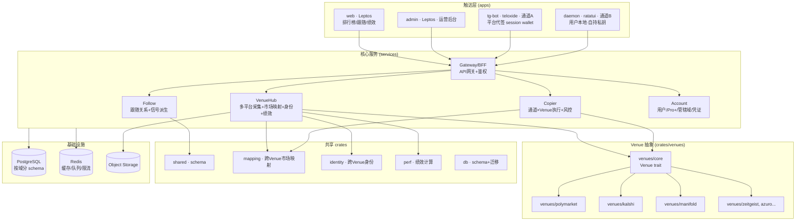
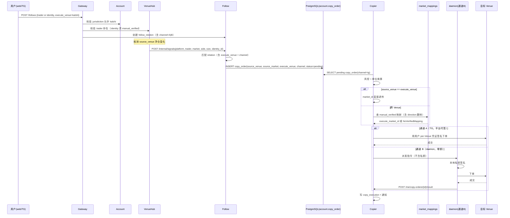

# Sharpside 架构设计

> Polymarket 跟单平台 · 多平台原生（Venue 一等公民）· 双通道（TG 热钥浮仓 + 自托管 daemon）· 主路径不自建链上索引（例外按需开启）

## 1. 项目定位

Sharpside 是一个**多平台预测市场跟单平台**，核心做四件事：

1. **接得广** —— 以 **Venue（平台）为一等公民**，统一抽象 Polymarket / Kalshi / Manifold / Zeitgeist / Azuro 等预测市场。每个 Venue 声明自己的能力：`signal_source`（能拿交易者数据）、`execution_venue`（能下单）、或两者。
2. **找得到** —— 从所有 signal_source Venue 拉交易者数据，本地算绩效；通过**跨平台身份**把同一人在多平台的表现合并；通过**市场映射**把同事件在不同 Venue 的合约对齐。**主路径不自建链上索引**，全部依赖各 Venue 官方 API；仅当某热钥历史深度超官方 API 上限时**按需**对个别地址走 subgraph 补全（详见 `DATA_SOURCES.md` §6）。
3. **跟得上** —— 两条跟单通道 × N 个执行 Venue 的矩阵：
   - **通道 A · TG 热钥浮仓**（对标 PolyCop / PolyGun；DW + type-3）：平台侧 TG bot，平台代签 session wallet（非完全非托管，详见 §6.3）。
   - **通道 B · 自托管 daemon**（polycopier 式）：**Pro+ 可选**，**平台零钥**，用户本地运行 daemon 自持私钥执行。
   - 跟随信号可来自任何 signal_source，执行可路由到任何 execution_venue（受用户管辖域约束）。
4. **运营得动** —— 模块低耦合、不过度拆分，按业务域聚合；运营面对的是"Venue × 业务面"二维菜单，认知清晰。

## 2. 核心概念词典

| 术语 | 含义 |
|---|---|
| **Venue（平台）** | 一个预测市场平台，一等公民。声明能力：`signal_source` / `execution_venue` |
| **Venue 能力** | `signal_source` = 可拿交易者数据；`execution_venue` = 可下单执行；两者可兼有 |
| **Market（合约）** | 某 Venue 上的一个可交易合约，键为 `(platform, venue_market_id)` |
| **Market Mapping** | 跨 Venue 的同事件合约等价关系，含 confidence + manual_verified |
| **Trader** | 一个 Venue 上的交易者，键为 `(platform, venue_trader_id)` |
| **Identity（身份）** | 跨 Venue 的同一人，由 `identities` 表聚合多个 Trader（启发式 + 人工） |
| **热钥 (Hot Key)** | 持续监控的"聪明钱"，可跨 Venue；浮仓 = 当前持仓快照 |
| **DW / type-3** | 交易者分类标签（持有型/高胜率型；交易手法型） |
| **零钥 (Zero-Key)** | 通道 B 特征：平台不存任何用户私钥，密钥只在用户本地 daemon |
| **Pro+** | 订阅档位，解锁通道 B + 跨 Venue 执行 + 高级风控 |
| **管辖域 (Jurisdiction)** | 用户所在法域，决定可用 execution_venue 集合（如 US KYC → 可用 Kalshi） |
| **跟随关系 (Follow)** | 用户 → Trader 或 Identity 的复制绑定，含 sizing/过滤器/上限/execute_venue 偏好 |
| **跟单指令 (CopyOrder)** | 含 `source_venue` + `execute_venue` 的标准化操作指令 |

## 3. 总体架构



## 4. 模块划分原则

- **Venue 一等公民**：所有跨平台逻辑围绕 `Venue` trait 抽象，新增平台只需实现 trait。
- **按业务域聚合**：5 个服务覆盖"采集映射身份 / 跟随 / 执行 / 账户 / 网关"，不按技术层切。
- **不过度拆微服务**：身份并入 VenueHub（紧耦合于交易者数据），避免 10+ 服务运维负担。
- **共享走 crates**：venue trait / 映射 / 身份 / 绩效 / schema 下沉到 `crates/`。
- **异步解耦靠 Postgres 表队列**：信号派生经同步 HTTP `POST /internal/signals`，跟单指令入 `account.copy_order` 表由 copier 轮询消费（未引入 Redis/apalis）。
- **全 Rust 主栈**：单二进制部署，serde 端到端类型共享（详见 TECH_STACK_RUST.md）。

## 5. 目录结构

```
sharpside/
├── crates/
│   ├── shared/              # serde 类型：CopyOrder/TradeEvent/Performance/Tag
│   ├── venues/
│   │   ├── core/             # Venue trait + Market/Position/Trade 抽象
│   │   ├── polymarket/       # Polymarket adapter（signal+execution）
│   │   ├── kalshi/           # Kalshi adapter（execution only）
│   │   ├── manifold/         # Manifold adapter（signal only）
│   │   └── zeitgeist/        # 预留（链上）
│   ├── mapping/              # 跨 Venue 市场映射（启发式 + 人工校对）
│   ├── identity/             # 跨 Venue 交易者身份链接
│   ├── perf/                 # 仓位重建 + 绩效计算（per trader + per identity）
│   └── db/                   # sqlx schema + 迁移
├── services/
│   ├── venue-hub/            # axum · 多平台采集 + 市场映射 + 身份 + 绩效 + 热钥监控
│   ├── follow/               # axum · 跟随关系 + 信号派生
│   ├── copier/               # axum · 通道×Venue 执行 + 风控
│   ├── account/              # axum · 用户/Pro+/管辖域/per-Venue 凭证
│   └── gateway/              # axum · API 网关 + 鉴权 + BFF
├── apps/
│   ├── web/                  # Leptos · 用户前端
│   ├── tg-bot/               # teloxide · 通道 A
│   ├── daemon/               # ratatui + alloy · 通道 B
│   └── admin/                # Leptos · 运营后台
├── infra/
│   └── docker-compose.yml
└── docs/
```

## 6. 五个核心服务职责

### 6.1 VenueHub · 多平台采集 + 市场映射 + 身份 + 绩效

**职责**：把"谁是优秀交易者"在多平台维度做到极致，**主路径不自建链上索引**。

- **多 Venue 采集**：每个 signal_source Venue 一个 adapter，拉 traders / positions / trades / leaderboard。
- **市场映射**：跨 Venue 同事件合约对齐（启发式匹配 + 人工校对），产出 `market_mappings`。
- **跨 Venue 身份**：把同一人在多平台的 Trader 记录聚合到 `identities`（启发式 + 人工）。
- **绩效计算**：per `(trader, period)` 与 per `(identity, period)` 双维度物化。
- **热钥浮仓监控**：per Venue 的热钥浮仓快照（自适应频率）。
- **影子校验**：第三方增强数据交叉校验（详见 SHADOW_MODE.md）。

**内部 worker 划分**（单进程多 worker，后续可按负载拆服务而不改对外 API）：

| Worker | 职责 | 失败影响 |
|---|---|---|
| ingest | 各 Venue 采集，写 raw_* | 该 Venue 信号暂停，其他不受影响 |
| mapping | 启发式候选 + 入审核队列 | 不阻塞跟单（无 verified 映射则跳过） |
| identity | 启发式链接 + 入审核队列 | 不阻塞跟单（仅影响 Identity 展示） |
| perf | 仓位重建 + 绩效物化 | 绩效延迟，展示读旧快照 |
| hot | 热钥浮仓快照（自适应频率） | 信号延迟，不丢数据 |
| shadow | 第三方抓取 + diff + 告警（旁路） | 主路径零影响 |

**对外 API**：
- `GET /venues` 列出已接入 Venue 及能力
- `GET /traders?platform=&sort=&period=`
- `GET /traders/{platform}/{id}` 详情
- `GET /identities/{id}` 跨平台身份详情
- `GET /markets?platform=&q=` 市场搜索
- `GET /market-mappings?from=&to=` 映射查询
- `POST /traders/import` 导入地址触发回填（指定 platform）

### 6.2 Follow · 跟随关系 + 信号派生

**职责**：把"跟谁、怎么跟、在哪执行"管起来。

- **跟随关系 CRUD**：可跟随单 Venue 的 Trader，或跨 Venue 的 Identity；含 sizing + execute_venue 偏好。
- **信号派生**：接收 VenueHub hot worker 的 `POST /internal/signals`（仓位 diff，带 `X-Internal-Secret`）→ 匹配 relation → `derive_copy_orders` 生成 `copy_order`（含 source_venue + execute_venue + channel）→ 入 `account.copy_order` 表（pending/skipped）。跟随 Identity 时强制校验 `identities.manual_verified=true`，否则跳过并告警。
- **跟随画像**：用户视角的"我跟随了谁、跨平台收益如何"。

**对外 API**：`POST /follows`、`GET /me/follows`、`PATCH /follows/{id}`、`DELETE /follows/{id}`。

### 6.3 Copier · 通道 × Venue 执行 + 风控

**职责**：把跨平台跟单指令落到目标 Venue。

- **市场映射翻译**：`copy_order.source_market_id` → 查 `market_mappings` → `execute_market_id`（同 Venue 时直接透传）。
- **通道 A（TG，Deposit Wallet 委托代签）**：用户资产在 Polymarket Deposit Wallet（ERC-1967 proxy，POLY_1271），平台持委托交易 owner EOA 私钥（KMS 加密）代签 CLOB 订单（signatureType=3），附 L2 HMAC 鉴权 + Builder 归因。**权限分层：资产权在 deposit wallet，交易权在平台**——比旧 session 句柄边界更细，但仍非完全非托管（平台持 owner EOA 私钥）。Polymarket 官方推荐新 API 用户走此路径。详见 `docs/CHANNEL_A_SIGNING.md`。
- **通道 B（daemon，零钥）**：daemon 拉指令本地签名下单；平台只派发与归集。
- **管辖域路由**：按 `user.jurisdiction` 过滤可用 execute_venue（US KYC → 可用 Kalshi）。
- **统一风控**：日成交上限、连续亏损熔断、rapid-flip 守卫、最小 notional、滑点保护（参数按通道/Venue/档位差异化）。

**对外 API**：
- 内部：轮询 `account.copy_order WHERE channel='tg' AND status='pending'`（Postgres 表队列）、写 `copy_execution`。
- daemon：`GET /me/copy-orders?since=`、`POST /me/copy-orders/{id}/result`（daemon_api_key）。

### 6.4 Account · 用户 / Pro+ / 管辖域 / per-Venue 凭证

**职责**：身份、订阅、管辖域、各 Venue 凭证。

- 用户注册/登录（web 与 TG 共用身份）。
- **管辖域**：`jurisdiction` 字段（US / EU / OTHER…），决定可用 execution_venue 集合。
- **Pro+ 订阅**：解锁通道 B + 跨 Venue 执行 + 高级风控 + 更多跟随槽位。
- **per-Venue 凭证**：`user_venue_credentials` 表，按 `(user_id, platform)` 存：
  - Polymarket：**DepositWalletDelegated**（deposit wallet 地址 + 委托交易 owner EOA 私钥 KMS 加密 + L2 HMAC 凭证 + Builder code，POLY_1271，见 `docs/CHANNEL_A_SIGNING.md`）；旧 Wallet 句柄保留兼容
  - Kalshi：KYC 账户 + API key（加密）
  - daemon_api_key 颁发与轮换（**绝不存私钥**）

**对外 API**：`POST /auth/wallet`（cookie-only）、`POST /auth/wallet/token`（程序化 Bearer）、`GET /me`、`POST /me/subscription`、`GET /me/venue-credentials`、`POST /internal/venue-credentials/{user_id}/{platform}`（须 `X-Internal-Secret`，gateway 屏蔽）、`POST /me/daemon-api-key`、`POST /me/deposit-wallet/provision`（活跃凭证须 `confirm_replace`）。

### 6.5 Gateway · API 网关 + BFF

- 统一入口、鉴权（JWT + daemon_api_key 双模式）、限流、BFF 聚合。
- daemon 长轮询单独限流组。
- BFF 一次调用拼装：跨平台排行榜 + 身份绩效 + 跟随状态 + 可用执行 Venue。

## 7. Venue 抽象（核心）

### 7.1 Venue 能力声明

```rust
bitflags! {
    pub struct VenueCapabilities: u8 {
        const SIGNAL_SOURCE  = 0b01;  // 可拿交易者数据
        const EXECUTION_VENUE = 0b10;  // 可下单执行
    }
}

pub struct VenueInfo {
    pub platform: Platform,           // Polymarket / Kalshi / Manifold / ...
    pub display_name: String,
    pub capabilities: VenueCapabilities,
    pub auth_model: AuthModel,         // Wallet / KycApiKey / None
    pub unit: Unit,                    // UsdcCtf / UsdCents / Mana
    pub geo: Geo,                      // Global / UsOnly / ...
}
```

| Venue | signal_source | execution_venue | auth | unit | geo |
|---|---|---|---|---|---|
| Polymarket | ✅ | ✅ | Wallet | USDC CTF 0–1 | Global (US 限类目) |
| Kalshi | ❌ | ✅ | KYC + API key + RSA | USD cents 1–99 | US only |
| Manifold | ✅ | ❌ | API key (玩钱) | Mana | Global |
| Zeitgeist | ✅ | ✅ | Wallet | 链上 | Global |
| Azuro | ✅ | ✅ | Wallet | 链上 | Global |

### 7.2 Venue trait

```rust
#[async_trait]
pub trait Venue: Send + Sync {
    fn info(&self) -> &VenueInfo;

    // signal_source 能力
    async fn leaderboard(&self, q: LeaderboardQuery) -> Result<Vec<Trader>>;
    async fn positions(&self, trader_id: &str) -> Result<Vec<Position>>;
    async fn trades(&self, trader_id: &str, q: Pagination) -> Result<Vec<Trade>>;
    async fn markets(&self, q: MarketQuery) -> Result<Vec<Market>>;

    // execution_venue 能力（仅执行类 Venue 实现）
    async fn place_order(&self, cred: &Credential, order: Order) -> Result<Fill>;
    async fn cancel_order(&self, cred: &Credential, id: &str) -> Result<()>;
    async fn order_status(&self, cred: &Credential, id: &str) -> Result<OrderStatus>;  // 状态机/部分成交
    async fn balance(&self, cred: &Credential) -> Result<Balance>;                     // 对账
    async fn book(&self, market_id: &str, token_id: &str) -> Result<OrderBook>;        // 滑点/深度
    async fn market_tradable(&self, market_id: &str) -> Result<bool>;                  // 可交易性
}
```

新增平台 = 新增 `crates/venues/<name>` 实现 `Venue` trait，注册到 `VenueRegistry`，主路径零改动。
**注意**：trait 稳住的是 API 形状，不降映射/合规/费率/流动性差异——这些仍需 per-Venue 适配（见 `MULTI_PLATFORM.md` §3）。

## 8. 市场映射（核心服务）

### 8.1 映射表

```sql
CREATE TABLE trader_hub.market_mappings (
    from_platform    text NOT NULL,
    from_market_id   text NOT NULL,
    to_platform      text NOT NULL,
    to_market_id     text NOT NULL,
    confidence       numeric NOT NULL,    -- 0–1，启发式匹配置信度
    manual_verified  boolean NOT NULL DEFAULT false,
    verified_by      text,
    verified_at      timestamptz,
    -- 方向翻转：Polymarket YES 可能对应 Kalshi No 合约，跟反方向会亏光
    direction_flip   boolean NOT NULL DEFAULT false,  -- true 表示 to 侧 outcome 与 from 侧相反
    -- resolution 规则对齐：同标题不同结算规则 = 假映射
    resolution_notes text,                            -- 人工标注的结算差异/对齐说明
    resolution_verified boolean NOT NULL DEFAULT false,
    -- 流动性/深度门槛：映射对了也可能无法按尺寸成交
    min_notional     numeric,                          -- 该映射建议的最小成交额，低于此跳过
    -- 失效与撤销：跟单中途市场下架/重映射
    status           text NOT NULL DEFAULT 'active',   -- active / retired / rejected
    retired_at       timestamptz,
    created_at       timestamptz NOT NULL DEFAULT now(),
    PRIMARY KEY (from_platform, from_market_id, to_platform, to_market_id)
);
```

### 8.2 映射流程

```
自动匹配（定时任务）：
  对每对 Venue 拉 markets → 标题/标签/结算时间相似度 → 候选映射
  confidence > 阈值 → 入表（manual_verified=false, status='active'）

人工校对（admin 后台）：
  候选映射进审核队列 → 运营确认/拒绝
  确认时须同时标注：direction_flip（YES↔NO 是否翻转）、resolution_notes、min_notional
  仅 manual_verified=true AND resolution_verified=true AND status='active' 的映射用于跨 Venue 跟单

跟单翻译（Copier）：
  copy_order(source_venue=A, source_market_id=X, execute_venue=B)
  → 查 market_mappings(A, X, B, ?) where manual_verified AND resolution_verified AND status='active'
  → 拿到 execute_market_id=Y + direction_flip
  → 若 direction_flip：翻转 side（Buy↔Sell）
  → 单位换算 + 风控（含 min_notional 校验）
  → 在 B 下单

映射失效：
  市场下架/重映射 → status='retired'，retired_at=now()
  Copier 命中 retired 映射 → 跳过该 copy_order，标记 skipped，通知用户
```

### 8.3 单位换算

Copier 内置 `UnitConverter`：Polymarket 0–1 USDC ↔ Kalshi 1–99 cents（×100），按 Venue `unit` 字段自动换算。

## 9. 跨 Venue 交易者身份

### 9.1 身份表

```sql
CREATE TABLE trader_hub.identities (
    id          uuid PRIMARY KEY,
    alias       text,
    confidence  numeric,           -- 启发式聚合置信度
    manual_verified boolean DEFAULT false,
    created_at  timestamptz DEFAULT now()
);

ALTER TABLE trader_hub.traders
    ADD COLUMN identity_id uuid REFERENCES trader_hub.identities(id);
```

### 9.2 链接策略

- **启发式**：同 X 用户名 / 同 profile 图 / 跨平台持仓高度相似（同事件同方向）→ 候选链接，confidence 评分。
- **人工**：运营在 admin 后台确认/拒绝候选；用户也可主动声明"我在 Kalshi 的账户是 X"。
- **身份级绩效**：`identity_performance` 视图聚合该 identity 下所有 Trader 的绩效，作为"跨平台优秀交易者"展示。
- **跟随门禁（硬规则）**：用户**只能跟随 `manual_verified=true` 的 Identity**。启发式候选（`manual_verified=false`）仅进审核队列与展示参考，**不进执行路径**。用户自声明绑定需二次验证（如签名挑战 / 平台账户回填校验）后才置 `manual_verified=true`。

## 10. 跨平台跟单流程



## 11. 双通道 × Venue 矩阵

| 通道 \ Venue | Polymarket | Kalshi | Manifold | Zeitgeist |
|---|---|---|---|---|
| TG Deposit Wallet 委托（A） | ✅ Deposit Wallet + 委托 owner EOA + L2 HMAC + Builder | ✅ KYC API key | — (玩钱不执行) | ✅ Deposit Wallet + 委托 owner EOA（待适配） |
| 自托管 daemon（B） | ✅ 用户私钥 | ✅ 用户 KYC+API key | — | ✅ 用户私钥 |

- 通道 A：平台持委托交易 owner EOA 私钥（KMS 加密）代签 CLOB 订单，资产在用户 Deposit Wallet（POLY_1271）。**权限分层：资产权（deposit wallet）vs 交易权（平台 KMS）**——比旧 session 句柄边界更细，详见 `docs/CHANNEL_A_SIGNING.md`。仍非完全非托管：平台持 owner EOA 私钥，owner 即 deposit wallet owner，可签 WALLET batch 转资产；Phase 2 把 deposit wallet owner 设为用户独立钥 + session signer delegate 后可达「非托管交易」。
- 通道 B：daemon 拉指令后，按 execute_venue 选对应签名方式（Polymarket 钱包 / Kalshi RSA），**平台零钥**。

## 12. 数据流（写入路径）

```
各 Venue 官方 API
   ├─ signal_source Venue ─→ raw_trades / raw_positions / raw_markets
   │                            ↓
   │                          position_timeline ─→ trader_performance
   │                            ↓                 identity_performance
   │                          market_mappings ← 启发式 + 人工
   │                          identities ← 启发式 + 人工
   │
   └─ execution_venue ─→ Copier 下单
       │   ├─ 通道 A：平台用委托交易 owner EOA（KMS 解密）代签 Deposit Wallet 订单（POLY_1271）+ L2 HMAC + Builder 归因
       │   └─ 通道 B：daemon 本地私钥签名（平台零钥，仅派发指令+归集结果）

运营 admin ─→ tag_rules / category_mapping / hot_wallets / market_mappings / identities

【旁路 · 影子模式 · 不进展示链路】
第三方 API ─→ trader_performance_third_party ─→ metric_audit（与自算 diff，仅告警）
```

> 影子路径与生产展示链路**完全解耦**：第三方指标永不进入用户界面，只写审计表 + 告警。详见 `SHADOW_MODE.md`。

## 13. 技术栈（全 Rust，详见 TECH_STACK_RUST.md）

| 层 | 选型 |
|---|---|
| Workspace | Cargo workspace + sccache + cargo nextest |
| 后端 5 服务 | axum 0.7 + tokio 1 + sqlx 0.8 + apalis + governor |
| Venue 抽象 | `crates/venues/core` 定义 trait，per-Venue crate 实现 |
| 前端 web/admin | Leptos 0.7（SSR + WASM）+ Tailwind 4 + echarts-rs |
| TG bot | teloxide 0.13 |
| daemon | tokio + reqwest + ratatui + alloy + rusqlite |
| DB | PostgreSQL 16（按域分 schema） |
| 缓存/队列 | 跟单队列用 PostgreSQL 表队列（`account.copy_order`）；Redis/apalis 未引入 |
| 监控 | tracing-otlp → Grafana + Sentry |

**可选增强**：Python 分析服务（PyO3 暴露 `crates/perf`）/ 前端切 Next.js（保留 Rust 后端，协议走 OpenAPI）。

## 14. 运营视角

- **Venue × 业务面 二维菜单**：行 = Venue（Polymarket/Kalshi/Manifold/...），列 = 业务面（交易者池/跟随/跟单风控/凭证），运营认知清晰。
- **Venue 开关**：admin 一键启用/停用某 Venue 的 signal_source 或 execution_venue 能力，停用不影响其他 Venue。
- **市场映射审核队列**：候选映射进队列，运营确认/拒绝，零代码。
- **身份审核队列**：跨平台身份候选，运营确认/拒绝。
- **热钥 per Venue**：每个 Venue 独立热钥清单与抓取频率。
- **Pro+ 商业化**：跨 Venue 执行、高级风控、跟随槽位扩展均挂在 Pro+。
- **风控三级覆盖**：全局 → 档位 → 用户，且可按 Venue 维度差异化。

## 15. 路线图

> **定位说明**：标题写「多平台原生」指**架构扩展轴**，非 MVP 同时多平台。Phase 1 严格单平台闭环，Venue trait 与表结构已为多平台预留，但首版只接 Polymarket。

| 阶段 | 内容 | Venue 范围 |
|---|---|---|
| **Phase 1a · 单通道闭环** | 2–3 服务（gateway + venue-hub + copier/account 合并）+ Polymarket adapter + 通道 A 或 B 二选一 + 最小 web | Polymarket only |
| **Phase 1b · 双通道补齐** | + 另一通道 + admin 后台 + 影子模式 + 完整风控 | Polymarket only |
| **Phase 2 · 信号扩容** | + Manifold adapter（signal only）+ 身份启发式 + 跨平台排行榜 | + Manifold |
| **Phase 3 · 跨 Venue 执行** | + Kalshi adapter（execution）+ 市场映射人工校对 + 管辖域路由 + 跨 Venue 跟单 | + Kalshi |
| **Phase 4 · 链上扩容** | + Zeitgeist/Azuro adapter（按需）+ 链上身份链接 | + Zeitgeist/Azuro |

每阶段独立可上线，不依赖下一阶段；Venue trait 保证新增平台**样板代码**成本恒定（映射/合规/费率成本另计，见 `MULTI_PLATFORM.md` §3）。

**可行性分层**（与 `MULTI_PLATFORM.md` 对齐）：

```text
高可行：Polymarket 同 Venue 跟单 + 自算绩效 + 双通道之一
中可行：Manifold 作辅助信号 / 标签（不执行）
条件可行：Polymarket 信号 → Kalshi 执行（强依赖映射质量 + US KYC 用户占比）
低优先：Zeitgeist/Azuro（量级 + 按需破「主路径不自建索引」原则）
```

## 16. 与原原则的兼容性

| 原则 | 多平台原生架构的体现 |
|---|---|
| 不自建链上数据 | 主路径走各 Venue 官方 API；超 API 上限的深度历史按需对个别地址走 subgraph（例外，可选）；Zeitgeist/Azuro 需链上索引时单独评估 |
| 低耦合不过度拆 | 5 服务 + Venue trait，新增平台不改主路径 |
| 适合运营 | Venue × 业务面二维菜单，运营面不随平台数膨胀 |
| 双通道跟单 | 通道 × Venue 矩阵，模型不变 |

## 17. 相关文档

| 文档 | 内容 | 状态 |
|---|---|---|
| VENUE_DESIGN.md | Venue trait + 市场映射 + 跨 Venue 身份 实现细节 | 多平台原生 |
| TECH_STACK_RUST.md | 全 Rust 技术栈详解 | 多平台原生 |
| MULTI_PLATFORM.md | 各 Venue 可行性与接入约束参考 | 参考 |
| DATA_SOURCES.md | Polymarket 官方 API 可获取数据清单 | Polymarket 专属，按 Venue 增补 |
| PERFORMANCE_PIPELINE.md | 绩效数据到网站端到端管道 | 单平台版，待加 platform 维度 |
| SHADOW_MODE.md | 交叉校验影子模式 | 通用 |
| THIRD_PARTY_DATA.md | 第三方增强数据入库与授权 | 通用 |
| `docs/archive/DATA_MODEL.md` | 表结构（单平台版，已归档移走） | **ARCHIVED** · schema 权威见 VENUEHUB_STORAGE.md + TRADERS_TABLE.md |
| VENUEHUB_STORAGE.md | VenueHub 存储总览 | 多平台原生版 |
| TRADERS_TABLE.md | traders 表字段详解 | 多平台原生版 |
| FLOWS.md | 关键流程时序图 | 多平台原生版 |
