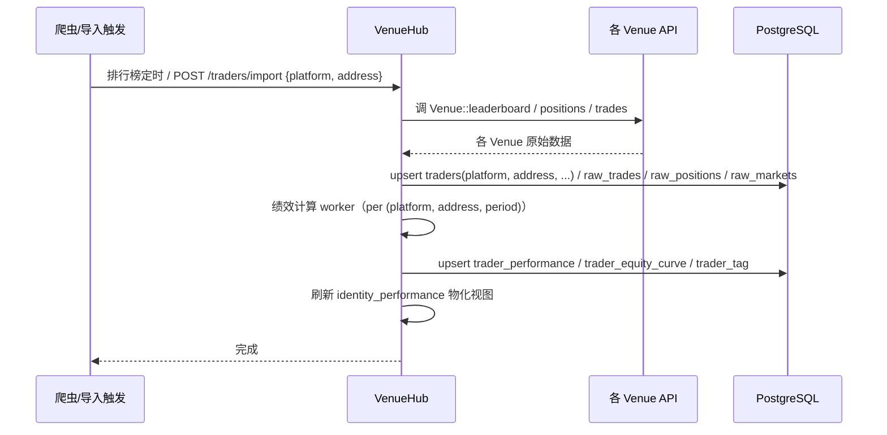
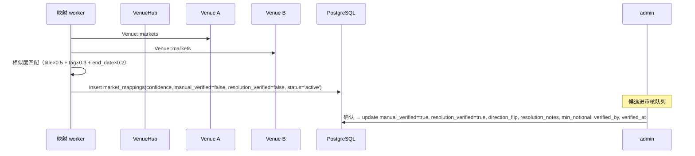
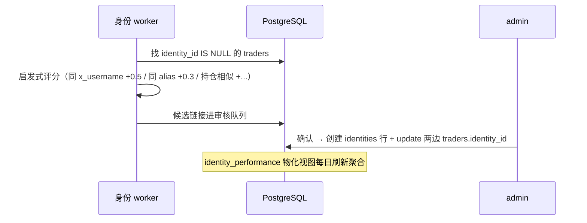
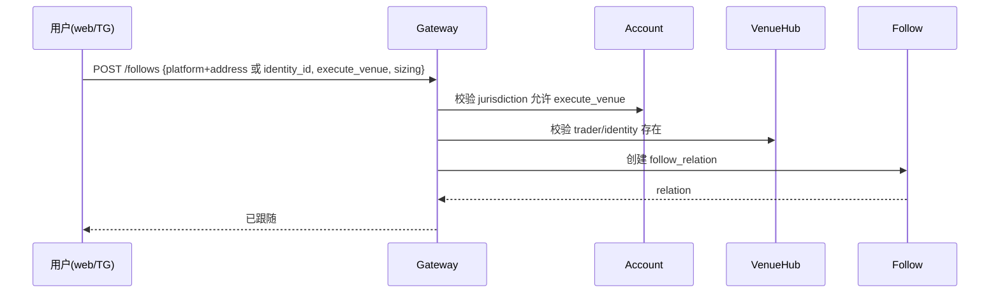
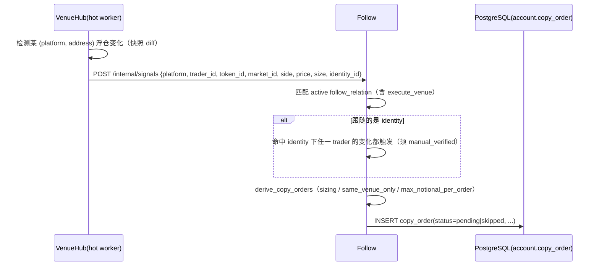
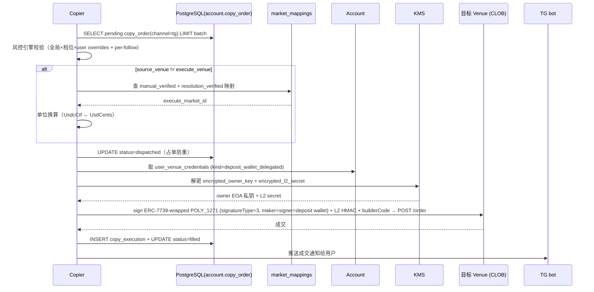
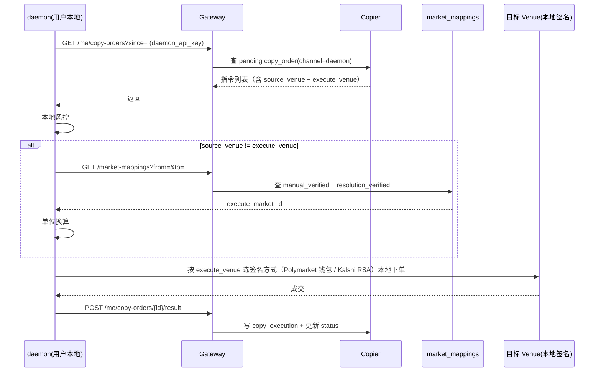
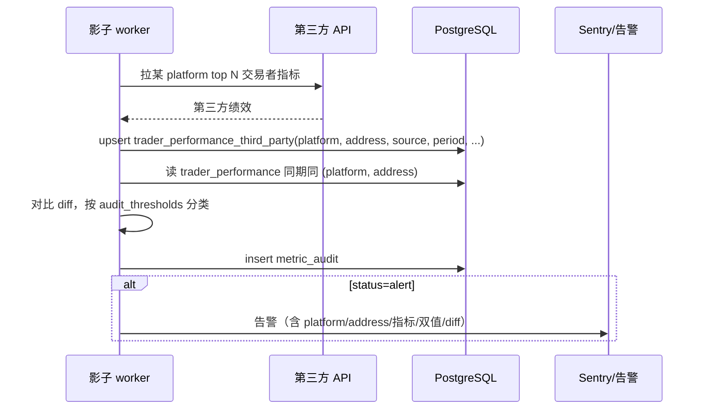

# 关键流程时序（多平台原生版）

> 涵盖多 Venue 采集、市场映射、跨 Venue 身份、跟随建立、信号派生、双通道 × Venue 执行、影子校验。

## 1. 多 Venue 数据回填



**要点**：每个 Venue 走自己的 adapter（实现 `Venue` trait），主路径不区分平台；Kalshi 不实现 signal_source 方法，不会被调到。

## 2. 市场映射（启发式 + 人工校对）



**要点**：跨 Venue 跟单只读 `manual_verified=true AND resolution_verified=true AND status='active'` 的映射；未确认的候选不影响主路径。

## 3. 跨 Venue 身份链接



## 4. 建立跟随（单 Venue 或跨 Venue 身份）



**要点**：跟随对象可以是单 Venue 的 trader，也可以是跨 Venue 的 identity；`execute_venue` 是用户偏好的执行 Venue，受 jurisdiction 约束。

## 5. 信号派生 → 跟单指令（跨 Venue）

> 实现口径：venue-hub hot worker 检出仓位 diff 后**同步 HTTP `POST {FOLLOW_URL}/internal/signals`**（携带 `X-Internal-Secret`）→ follow 派生 → 入 **Postgres `account.copy_order` 表队列**（非 Redis）。



## 6. 通道 A 执行（TG Deposit Wallet 委托代签，跨 Venue）

> 详见 `docs/CHANNEL_A_SIGNING.md` §3.2。FrenFlow 式：资产在 Polymarket Deposit Wallet（POLY_1271），平台持委托交易 owner EOA（KMS）代签。
> 队列实现：copier worker 轮询 **Postgres `account.copy_order WHERE channel='tg' AND status='pending'`**（表队列，非 Redis）。



## 7. 通道 B 执行（自托管 daemon · 平台零钥 · 跨 Venue）



**要点**：平台全程不接触用户私钥/KYC 凭证；daemon 按 execute_venue 选本地签名方式；映射查询走 gateway 只读接口。

## 8. 管辖域路由

```mermaid
flowchart LR
  U[用户 jurisdiction] --> ACC[Account]
  ACC -->|jurisdiction=US| VEN1[可用: Polymarket(限类目) + Kalshi]
  ACC -->|jurisdiction=EU| VEN2[可用: Polymarket + Zeitgeist + Azuro]
  ACC -->|jurisdiction=OTHER| VEN3[可用: Polymarket + Manifold(信号) + Zeitgeist + Azuro]
  VEN1 --> CPY[Copier 过滤 execute_venue]
  VEN2 --> CPY
  VEN3 --> CPY
  CPY -->|execute_venue 不在允许集| SKIP[跳过 + 通知]
  CPY -->|execute_venue 在允许集| EXEC[执行]
```

**要点**：`account.users.jurisdiction` 决定可用 execution_venue 集合；Copier 在派发指令前过滤，不合规直接 skip 并通知用户。

## 9. 影子校验（per Venue）



**要点**：影子校验 per (platform, address) 进行，与生产展示链路完全解耦；详见 `SHADOW_MODE.md`。

## 10. 风控三级覆盖（per Venue 可差异化）

```
全局默认（copier 配置）
  └─ 档位覆盖（free / pro_plus）
      └─ 用户覆盖（account.users.risk_overrides）
          └─ Venue 覆盖（per-Venue 风控参数，如 Kalshi 持仓上限、Polymarket 滑点容忍）
```

每次取指令时按"Venue > 用户 > 档位 > 全局"合并生效参数。不同 Venue 的费率/流动性/持仓限制差异通过 Venue 覆盖层吸收。
