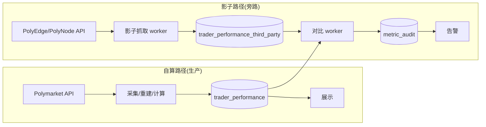

# 交叉校验 · 影子模式（Shadow Mode）

> 用第三方增强端点（PolyEdge / PolyNode）的指标，**只校验、不展示**，验证 sharpside 自算公式的正确性并持续监控数据漂移。
> 这是"不上 Enterprise 授权、零展示风险"前提下，最大化利用第三方数据的最佳用法。

## 1. 影子模式是什么

```
自算路径（生产）：  Polymarket API → 自算指标 → 物化 → 展示给用户
影子路径（旁路）：  第三方 API → 第三方指标 → 入审计表 → 与自算 diff → 告警
                       ↑ 不进展示链路，只进监控链路
```

特征：
- **不展示**：第三方指标永不出现在用户界面
- **不替代**：自算指标始终是唯一展示来源
- **只对比**：第三方指标仅用于与自算值做差值，写审计表 + 告警
- **可随时关停**：第三方挂了/涨价/停用，主路径完全不受影响

## 2. 价值

| 价值 | 说明 |
|---|---|
| 上线前验证公式 | 自算 Sharpe/ROI/胜率与第三方对照，发现公式 bug |
| 上线后监控漂移 | 自算与第三方持续偏离 → 数据源变化或自算退化 |
| 发现官方 API 异常 | 两边都偏离 → 大概率是 Polymarket 数据侧问题 |
| 风险零 | 不展示即不触发"commercial redistribution"条款 |
| 成本低 | PolyNode Starter $50/mo 或 PolyEdge Individual $99/mo 即可 |

## 3. 数据流



两条路径完全解耦：影子路径故障不影响生产展示。

## 4. 触发节奏

| 任务 | 频率 | 触发方式 |
|---|---|---|
| 第三方抓取 | 每小时 | cron / apalis 定时 |
| 对比 worker | 抓取完成后 | 事件触发（抓取完成事件） |
| 告警评估 | 对比完成后 | 事件触发 |
| 全量回溯对比 | 每日一次 | 定时（低峰期） |

抓取范围：第三方排行榜 top N（如 top 500）+ 本地标记为 hot 的全部钱包。

## 5. 数据库 schema

### trader_performance_third_party（第三方原始快照）

| 列 | 类型 | 说明 |
|---|---|---|
| address | text | |
| source | text | `polyedge` / `polynode` |
| period | text | `1H`/`1D`/`7D`/`30D`/`ALL` |
| roi | numeric | |
| win_rate | numeric | |
| realized_pnl | numeric | |
| unrealized_pnl | numeric | |
| wins | int | |
| losses | int | |
| markets_count | int | |
| total_volume | numeric | |
| fetched_at | timestamptz | |
| 索引 | (source, period, fetched_at), (address, source, period) | |

### metric_audit（对比结果）

| 列 | 类型 | 说明 |
|---|---|---|
| id | bigserial PK | |
| address | text | |
| source | text | |
| period | text | |
| metric_name | text | `roi`/`win_rate`/`sharpe`/`max_drawdown`/`pnl` |
| self_value | numeric | sharpside 自算 |
| third_party_value | numeric | 第三方值 |
| diff_abs | numeric | 绝对差 |
| diff_pct | numeric | 相对差 % |
| status | text | `ok`/`warn`/`alert` |
| audited_at | timestamptz | |
| 索引 | (status, audited_at), (address, metric_name) | |

## 6. 对比规则

### 6.1 指标映射

第三方与自算字段对齐（注意口径差异）：

| 第三方字段 | 自算字段 | 对齐说明 |
|---|---|---|
| `roi` | `trader_performance.roi` | 直接比 |
| `win_rate` | `trader_performance.win_rate` | 直接比 |
| `realized_pnl` | sum(realized_pnl) | 同口径 |
| `unrealized_pnl` | sum(open_size*(mark-avg_cost)) | mark 价时点可能不同，容忍 |
| `wins`/`losses` | count(positions by pnl sign) | 直接比 |
| `total_volume` | sum(trade size*price) | 直接比 |
| — | `sharpe`/`max_drawdown` | 第三方不给，**单向校验**（自算无对照） |

### 6.2 阈值

| 指标 | warn | alert | 说明 |
|---|---|---|---|
| roi | diff_pct > 5% | > 15% | ROI 口径敏感 |
| win_rate | diff_abs > 3pp | > 10pp | 胜率以百分点计 |
| realized_pnl | diff_pct > 5% | > 20% | |
| unrealized_pnl | diff_pct > 10% | > 30% | mark 时点差异容忍 |
| wins/losses | diff_abs > 2 | > 5 | |
| total_volume | diff_pct > 3% | > 10% | |

阈值放 `trader_hub.audit_thresholds` 表，运营/数据工程师可调，不改代码。

### 6.3 status 判定

```
status = ok    if diff <= warn
        warn  if warn  < diff <= alert
        alert  if diff > alert
```

## 7. 告警

| 通道 | 触发 | 内容 |
|---|---|---|
| 日志 | 每次 diff > warn | 结构化日志（tracing） |
| Sentry | 单条 alert | 异常事件，含地址/指标/双值/diff |
| 每日报告 | 每日 | 聚合：alert 数、top 10 偏离地址、偏离指标分布 |
| 告警抑制 | 同 (address, metric) 24h 内只告警一次 | 避免噪音 |

## 8. 报表与可视化（仅运营/数据团队可见）

admin 后台"数据健康"页：

- **总体一致率**：最近 24h ok 占比（目标 > 95%）
- **偏离热力图**：metric × period 的 alert 计数
- **Top 偏离地址**：表格，点击下钻看双值与历史趋势
- **指标趋势**：某地址某指标的 self vs third_party 时间序列折线
- **审计明细表**：metric_audit 全量筛选查询

## 9. Rust 实现骨架（crates/perf + 服务）

### 9.1 crates/shared 新增类型

```rust
#[derive(Serialize, Deserialize)]
pub struct ThirdPartyPerformance {
    pub address: String,
    pub source: ThirdPartySource,
    pub period: String,
    pub roi: Option<f64>,
    pub win_rate: Option<f64>,
    pub realized_pnl: Option<f64>,
    pub unrealized_pnl: Option<f64>,
    pub wins: Option<i64>,
    pub losses: Option<i64>,
    pub markets_count: Option<i64>,
    pub total_volume: Option<f64>,
    pub fetched_at: DateTime<Utc>,
}

#[derive(Serialize, Deserialize)]
pub struct MetricAudit {
    pub address: String,
    pub source: ThirdPartySource,
    pub period: String,
    pub metric_name: String,
    pub self_value: Option<f64>,
    pub third_party_value: Option<f64>,
    pub diff_abs: Option<f64>,
    pub diff_pct: Option<f64>,
    pub status: AuditStatus,
    pub audited_at: DateTime<Utc>,
}
```

### 9.2 影子抓取 worker（services/venue-hub 内）

```rust
// 每小时触发
async fn run_shadow_fetch(
    polyedge: PolyEdgeClient,
    polynode: PolyNodeClient,
    db: PgPool,
) -> Result<()> {
    let targets = load_targets(&db).await?; // top500 + hot wallets
    for source in [ThirdPartySource::PolyEdge, PolyNode] {
        for addr in &targets {
            let perf = fetch_third_party(&source, addr).await?;
            upsert_third_party(&db, perf).await?;
        }
    }
    emit_event("shadow.fetch.done").await;
    Ok(())
}
```

### 9.3 对比 worker

```rust
async fn run_audit(db: PgPool, thresholds: AuditThresholds) -> Result<()> {
    let recent = load_recent_third_party(&db).await?;
    for tp in recent {
        let self_perf = load_self_performance(&db, &tp.address, &tp.period).await?;
        for (name, diff) in compare(&self_perf, &tp) {
            let status = thresholds.classify(name, diff);
            insert_audit(&db, MetricAudit { ... }).await?;
            if status == Alert {
                sentry::capture_message(...);
            }
        }
    }
    Ok(())
}
```

### 9.4 compare 纯函数（可单测）

```rust
pub fn compare(self_p: &Performance, tp: &ThirdPartyPerformance) -> Vec<(MetricName, Diff)> {
    let mut out = vec![];
    if let (Some(s), Some(t)) = (self_p.roi, tp.roi) {
        out.push(("roi", pct_diff(s, t)));
    }
    if let (Some(s), Some(t)) = (self_p.win_rate, tp.win_rate) {
        out.push(("win_rate", abs_diff(s, t)));
    }
    // ... 其余指标
    out
}
```

## 10. 上线与退出流程

### 10.1 上线前（冷启动校验）

1. 跑 7 天影子模式，收集 metric_audit
2. 目标：所有指标 ok 率 > 95%
3. 偏离案例逐个人工复核，修正自算公式
4. ok 率达标 → 上线主路径
5. 影子模式继续运行（持续监控）

### 10.2 持续运行

- 每日报告进运营群
- alert 触发 → oncall 24h 内复核
- 阈值表按季节调整

### 10.3 退出条件

任一情况可关闭影子模式：
- 自算与第三方连续 30 天 ok 率 > 99%（公式稳定）
- 第三方涨价超预算
- 第三方服务停服/改条款

关闭只需停掉影子抓取 worker，主路径零影响。

## 11. 成本与风险

| 项 | 值 |
|---|---|
| 授权成本 | PolyNode Starter $50/mo 或 PolyEdge Individual $99/mo（个人/内部用） |
| 工程成本 | 抓取 worker + 对比 worker + admin 报表页，约 3–5 人日 |
| 额外依赖 | 第三方 API 可用性（旁路，挂了不影响主路径） |
| 法律风险 | 不展示即不触发"commercial redistribution"，符合 personal use |
| 误判风险 | 第三方口径与自算不完全一致 → 阈值需调，初期会有噪音 |

## 12. 与主架构的关系

- **位置**：services/venue-hub 内的旁路 worker，不新增服务
- **数据**：独立 schema 表（third_party / audit），与生产表物理隔离
- **开关**：配置项 `shadow_mode.enabled`，一键关停
- **不影响**：主路径采集/计算/展示链路完全无感
